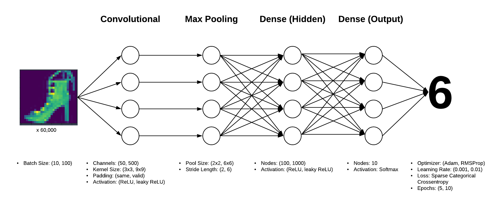
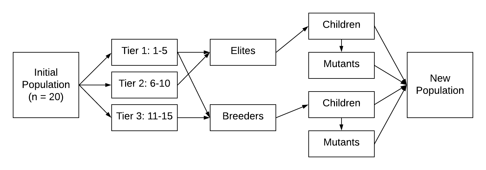
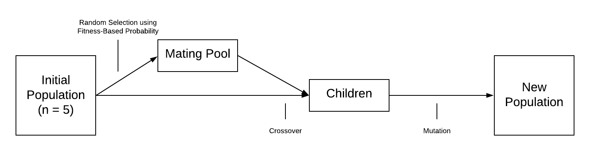

# CNN-Evolve

## Design

CNN-Evolve evaluates various combinations of the hyperparameter values of a Convolutional Neural Network and utilizes their resulting fitness to determine successive combinations, optimizing to peak fitness as generations progress. To achieve this, the application relies on 2 major components: the neural network, implemented using Tensorflow’s Keras API, and the genetic algorithm, written from scratch utilizing a series of loops that evaluate and modify lists of indexes corresponding to hyperparameter values (e.g. [0,1,0,1,0,1,0,1,0,1,0,1]). There are 12 different hyperparameters under evaluation, each with a binary set of values, resulting in 2^12 (4,096) different combinations of values. 

The neural network component of the application is wrapped in a function which takes the list of indexes as input and returns both the resulting model’s accuracy on the test dataset as well as the training accuracy per epoch as output. It will perform on any greyscale image dataset from the Tensorflow Datasets API, identifying image shape and number of classes using the dataset’s metadata object. The neural network attempts to classify these images using an architecture of 1 convolutional layer, 1 max pooling layer, 1 flattening layer, and 2 dense layers: 1 hidden and 1 output. Figure F4 illustrates this architecture and the hyperparameter values at each layer. All hyperparameter values under evaluation are denoted as a set (). The flattening layer is excluded for clarity.
 

Figure F4: Neural Network architecture with hyperparameter value options
	
There are 2 different methodologies used by the genetic algorithm to determine subsequent generations of genomes to be evaluated. The first, a tiered approach, directly determines mating candidates and the frequency at which they are mated based on rank. It also mutates aggressively, resulting in a population in which half of its genomes contain a mutated allele. While this provides a rapid increase in fitness over a small number of generations, it is potentially susceptible to local maxima, forgoing potential improvements that could have been obtained via minor changes to poorly-performing genomes. The second methodology uses a traditional genetic algorithm approach in which a higher fitness is relative to a higher likelihood that the genome is selected for mating, but is not a guarantee. As well, the mating pool is mated to the initial population, ensuring that attributes from lower-performing genomes are not immediately bred out but slowly recede over time. This avoids the tendency toward optimization to local maxima but necessitates additional generations in order to provide a sustained increase in fitness. 

### Methodology 1: Tiered selection
Starting with a random sample of 20 genomes, the genetic algorithm component of the application determines the fitness of each by applying the neural network function, then identifies 3 tiers:

* Tier 1: Fitness rank 1-5
* Tier 2: Fitness rank 6-10
* Tier 3: Fitness rank 11-15

From these, tiers 1 and 2 are combined to create a pool of ‘Elites’, while tiers 1 and 3 are combined to create a pool of ‘Breeders’. Selection in this way ensures that the attributes of the poorest-performing 5 genomes are not passed to successive generations, while the attributes of the best-performing 5 genomes are twice as likely to be passed on. Once parent pools are established, genomes within those pools are paired at random to generate children via crossover, where a list location is chosen at random to delineate the attributes taken from the 1st vs 2nd genome. These children are then copied and mutated, changing the value at a random list location. This process results in the creation of 10 children and 10 mutants, which form the next generation of genomes tested. This is illustrated in figure F5.

Figure F5: Genetic algorithm process - Tiered (1 generation)

### Methodology 2: Probability-based selection
Starting with a random sample of 5 genomes, the genetic algorithm component of the application determines the fitness of each. 5 genomes are then randomly sampled with replacement from these using a probability based on their relative fitness (for example, if one genome had a fitness score of .60 while the others had a score of .10 each, that genome would be 60% likely to be picked for each of the 5 samples). These 5 samples are then mated to a corresponding genome from the initial population via crossover to create 5 children. A mutation rate applied to the total number of alleles in the population determines the number of alleles to be mutated, which are then picked at random and mutations applied. The resulting mutated child genomes form the population for the subsequent generation. This process is illustrated in figure F6.

While the total number of genome evaluations performed (100) is the same as the tiered methodology, the population size and number of generations are inverse, with a smaller population size of 5 evolved over a larger number of generations, 20. There are 2 reasons for this. One is that the methodology is designed to optimize more slowly, so it is necessary to evolve it over a higher number of generations to observe the same performance as the tiered method. Since it is computationally burdensome to evolve the same number of genomes for a longer duration, the number of genomes is reduced to provide computational equivalency. The second reason is that even within this methodology of probability-based selection, it has been shown that smaller populations evolved over a larger number of generations provide better results than larger populations evolved over a smaller number of generations. 

 
Figure F6: Genetic algorithm process – Probability-based Selection (1 generation)

